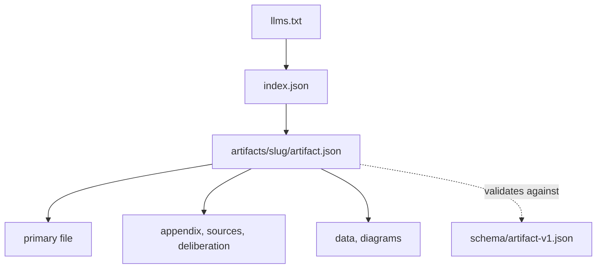

# Site and bundle layout

```mermaid
flowchart TD
  L[llms.txt] --> I[index.json]
  I --> M[artifacts/slug/artifact.json]
  M --> P[primary file]
  M --> A[appendix, sources, deliberation]
  M --> D[data, diagrams]
  M -. validates against .-> S[schema/artifact-v1.json]
```
